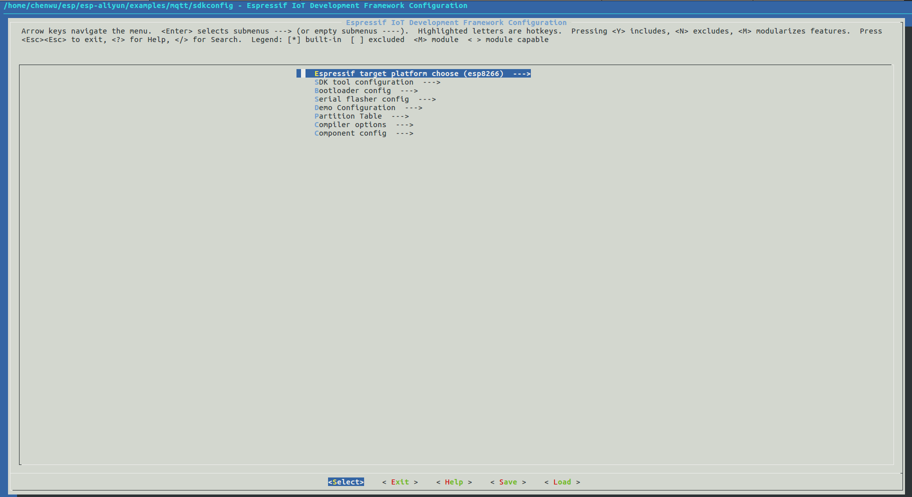

# ESP 设备对接蜂信物联网平台指南
# 目录

- [0.介绍](#Introduction)  
- [1.目的](#aim)  
- [2.硬件准备](#hardwareprepare)  
- [3.阿里云平台准备](#aliyunprepare)  
- [4.环境搭建](#compileprepare)  
- [5.SDK 准备](#sdkprepare)  
- [6.编译&烧写&运行](#makeflash)  

# <span id = "Introduction">0.介绍</span>
[乐鑫](https://www.espressif.com/zh-hans)是高集成度芯片的设计专家，专注于设计简单灵活、易于制造和部署的解决方案。乐鑫研发和设计 IoT 业内集成度高、性能稳定、功耗低的无线系统级芯片，乐鑫的模组产品集成了自主研发的系统级芯片，因此具备强大的 Wi-Fi 和蓝牙功能，以及出色的射频性能。

[FastBee开源物联网平台](https://gitee.com/kerwincui/wumei-smart)FastBee开源物联网平台，简单易用，更适合中小企业和个人学习使用。适用于智能家居、智慧办公、智慧社区、农业监测、水利监测、工业控制等。

需要定制相关功能可以联系微信：a7491772
邮箱：908349383@qq.com

# <span id = "aim">1.目的</span>
本文基于 linux 环境，介绍 ESP 设备对接阿里云平台的具体流程，供读者参考。当前只维护 **smart_light** 和 **solo** 示例，这两个示例包含了另外三个示例的功能，建议直接选择这两个示例 demo。

# <span id = "hardwareprepare">2.硬件准备</span>
- **linux 环境**  
用来编译 & 烧写 & 运行等操作的必须环境。 
> windows 用户可安装虚拟机，在虚拟机中安装 linux。

- **ESP 设备**  
ESP 设备包括 [ESP芯片](https://www.espressif.com/zh-hans/products/hardware/socs)，[ESP模组](https://www.espressif.com/zh-hans/products/hardware/modules)，[ESP开发板](https://www.espressif.com/zh-hans/products/hardware/development-boards)等。

- **USB 线**  
连接 PC 和 ESP 设备，用来烧写/下载程序，查看 log 等。

# <span id = "aliyunprepare">3.蜂信物联网平台准备</span>
根据[蜂信物联网平台文档](https://fastbee.cn/doc/pages/begin/#%E4%B8%89%E3%80%81%E5%AE%9A%E4%B9%89%E7%89%A9%E6%A8%A1%E5%9E%8B)，在蜂信物联网平台创建产品，创建设备，同时自动产生 `产品编号`, `设备编号`, `MQTT连接账号`, `MQTT连接密码`。  


# <span id = "compileprepare">4.环境搭建</span>
**如果您熟悉 ESP 开发环境，可以很顺利理解下面步骤; 如果您不熟悉某个部分，比如编译，烧录，需要您结合官方的相关文档来理解。如您需阅读 [ESP-IDF 编程指南](https://docs.espressif.com/projects/esp-idf/zh_CN/latest/index.html)文档等。**  

## 4.1 编译器环境搭建
- ESP8266 平台: 根据[官方链接](https://github.com/espressif/ESP8266_RTOS_SDK)中 **Get toolchain**，获取 toolchain
- ESP32  & ESP32S2 平台：根据[官方链接](https://github.com/espressif/esp-idf/blob/master/docs/zh_CN/get-started/linux-setup.rst)中 **工具链的设置**，下载 toolchain

toolchain 设置参考 [ESP-IDF 编程指南](https://docs.espressif.com/projects/esp-idf/zh_CN/latest/get-started/index.html#get-started-setup-toolchain)。  
## 4.2 烧录工具/下载工具获取
- ESP8266 平台：烧录工具位于 [ESP8266_RTOS_SDK](https://github.com/espressif/ESP8266_RTOS_SDK) 下 `./components/esptool_py/esptool/esptool.py`
- ESP32 & ESP32S2 平台：烧录工具位于 [esp-idf](https://github.com/espressif/esp-idf) 下 `./components/esptool_py/esptool/esptool.py`

esptool 功能参考:  

```
$ ./components/esptool_py/esptool/esptool.py --help
```

# <span id = "sdkprepare">5.SDK 准备</span> 
- [IOTDeviceSDK](https://gitee.com/zhuangpengli/IOTDeviceSDK), 通过该 SDK 可实现使用 MQTT 协议，连接 ESP 设备到蜂信物联网平台。
- Espressif SDK
  - ESP32 & ESP32S2 平台: [ESP-IDF](https://github.com/espressif/esp-idf)
  - ESP8266 平台: [ESP8266_RTOS_SDK](https://github.com/espressif/ESP8266_RTOS_SDK)

> Espressif SDK 下载好后：  
> ESP-IDF: 请切换到 v4.2 分支： `git checkout v4.2`
如果需要使用 ESP32S2 模组，请切换到 v4.2 版本： `git checkout v4.2`
> ESP8266_RTOS_SDK: 请切换到 v3.3 分支： `git checkout v3.3`

# <span id = "makeflash">6.编译 & 烧写 & 运行</span>
## 6.1 编译

### 6.1.1 导出编译器
参考 [工具链的设置](https://docs.espressif.com/projects/esp-idf/zh_CN/latest/get-started/linux-setup.html)

### 6.1.2 编译 demo 示例
**由于 esp32 和 esp8266 将会采用不同的 sdkconfig.defaults 和对应的 partitions.csv，在对应的 make 命令中加入了对应的芯片选项，如 chip=esp32 或 chip=esp8266。**

当 chip=esp32 时将默认使用 sdkconfig_esp32.defaults 以及 partitions_esp32.csv。

当 chip=esp8266 时将默认使用 sdkconfig_esp8266.defaults 以及 partitions_esp8266.csv。

当使用 esp32s2 时，将默认使用 sdkconfig.defaults ，sdkconfig.defaults.esp32s2 以及 partitions_esp32s2.csv，编译方式与 8266 & 32 都不一样，需要使用 cmake 进行编译。

以上需要特别注意。

在 esp-aliyun 目录下执行：

```
cd examples/solutions/smart_light
make chip=esp32 defconfig
make menuconfig
```

如果需要编译esp32s2版本, 请按照如下步骤编译:

执行如下命令，以 solo 示例为例，目前只支持 solo 和 smart_light 示例。

```
cd examples/solo/example_solo
idf.py set-target esp32s2
idf.py menuconfig
```



- 配置烧写串口
- 配置 `WIFI_SSID`, `WIFI_PASSWORD`

如果需要编译esp32s3版本, 当前只支持 master 版本。请按照如下步骤编译:

执行如下命令，以 solo 示例为例，目前只支持 solo 和 smart_light 示例。

```
cd examples/solo/example_solo
idf.py set-target esp32s3
idf.py menuconfig
```

2.生成最终 bin

```
make -j8
```
使用 esp32s2/esp32s3 生成 bin

```
idf.py build
```

## 6.2 擦除 & 编译烧写 & 下载固件
将 USB 线连接好 ESP 设备和 PC,确保烧写端口正确。 

### 6.2.1[可选] 擦除 flash
```
make erase_flash
```
> 注：无需每次擦除，擦除后需要重做 6.2.3。

### 6.2.2 烧录程序
```
make flash
```

使用 esp32s2/esp32s3 擦除 flash
```
idf.py -p (PORT) erase_flash
```
