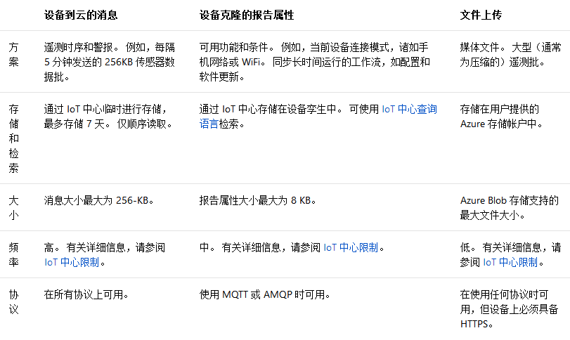
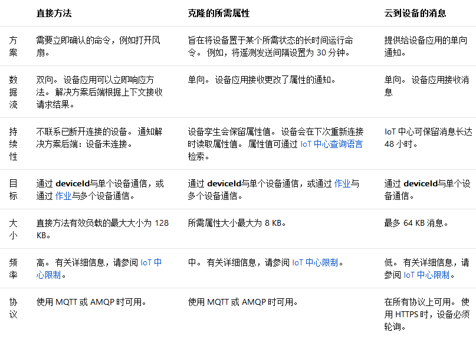

# 使用指南

Azure IoT 中心是一项完全托管的服务，有助于在数百万台设备和单个解决方案后端之间实现安全可靠的双向通信。Azure IoT 中心提供如下功能：

- 使用每个设备的安全凭据和访问控制来保护通信安全
- 多个设备到云和云到设备的超大规模通信选项
- 各设备状态信息和元数据的可查询存储
- 通过最流行语言和平台的设备库来方便建立设备连接

## 设备到云通信
将信息从设备应用发送到解决方案后端时，IoT 中心会公开三个选项：

- 设备到云消息，用于时序遥测和警报
- 设备克隆的报告属性用于报告设备状态信息，例如可用功能、条件或长时间运行的工作流的状态。 例如，配置和软件更新
- 文件上传，用于由间歇性连接的设备上传的或为了节省带宽而压缩的媒体文件和大型遥测批文件

下面是各种设备到云通信选项的详细比较：

应用程序可能需要同时将信息作为遥测时序或警报发送，并且使其在设备孪生中可用。 在这种情况下，可以选择以下选项之一：

- 设备应用发送一条设备到云消息并报告属性更改
- 解决方案后端在收到消息时可将信息存储在设备孪生的标记中

由于设备到云消息允许的吞吐量远高于设备孪生更新，因此有时需要避免为每条设备到云消息更新设备孪生。

## 云到设备通信

IoT 中心提供三个选项，允许设备应用向后端应用公开功能：

- 直接方法，适用于需要立即确认结果的通信。 直接方法通常用于以交互方式控制设备，例如打开风扇
- 孪生的所需属性，适用于旨在将设备置于某个所需状态的长时间运行命令。 例如，将遥测发送间隔设置为 30 分钟
- 云到设备消息，适用于向设备应用提供单向通知

下面详细比较了各种从云到设备的通信选项：

在以下教程中学习如何使用直接方法、所需属性以及从云到设备的消息：

- [使用直接方法](https://docs.azure.cn/zh-cn/iot-hub/iot-hub-node-node-direct-methods)：针对直接方法
- [使用所需属性配置设备](https://docs.azure.cn/zh-cn/iot-hub/iot-hub-node-node-twin-how-to-configure)：针对设备孪生的所需属性
- [发送从云到设备的消息](https://docs.azure.cn/zh-cn/iot-hub/iot-hub-node-node-c2d)：针对从云到设备的消息

## 参考资料

Azure 文档中心提供了丰富的开发资料，更多详细资料可以参考如下地址：

- [Azure 官网](https://www.azure.cn/zh-cn/home/features/what-is-azure/)
- [IoT 中心文档](https://docs.azure.cn/zh-cn/iot-hub/)
- [Azure 开发指南](https://docs.azure.cn/zh-cn/iot-hub/iot-hub-devguide)
